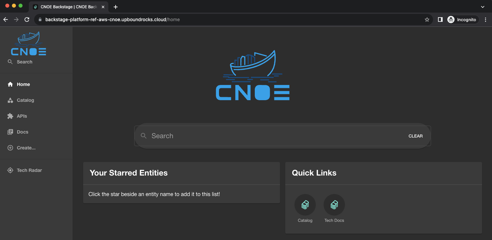
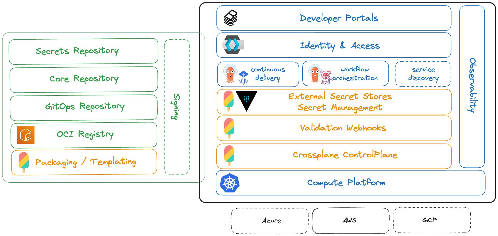

# CNOE's reference platform example setup on AWS using Crossplane.

Every organization has unique requirements for their internal developer platforms (IDPs), making it unreasonable and impractical to design a one-size-fits-all solution.

While there are common practices in using various tools within IDPs, there is a lack of references on configuring and combining these tools effectively to implement desired platform engineering practices.

CNOE's objective is to document and provide references for tools frequently utilized by platform engineers in designing IDPs. This includes details on tool configurations and implementations of common patterns and practices that can be adapted across organizations.

In this CNOE platform reference, we're working with AWS, relying on Crossplane as the backbone for our control plane. We use its packaging features for our APIs and leverage Kubernetes' validation options for the entire stack. While our goal isn't to cover everything, we're committed to gathering community-driven patterns and best practices that reflect common deployments in production.

For CNOE reference implementations we will provide configurations, patterns, and practices with the following (growing) list of technologies.

  **Capability**              | **Technologies**
------------------------------|---------------------------------
Code Repository               | Git
Config Repository             | Git
Artifact Registry             | Container Registries
Secret Repository             | External Secrets (with Vault and KMS)
Validations                   | Crossplane Validation Webhooks
Secret Management             | Crossplane ESS, External Secrets
ControlPlane                  | Crossplane
Continuous Delivery           | Argo CD, Flux
Continuous Integration        | Argo Workflows, Tekton
Identity & Access             | Keycloak
Developer Portals             | Backstage
